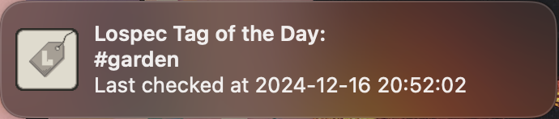

# LTOTD
### "Lospec Tag of the Day"

A Mac OS menu bar app that displays the "Tag of the Day" from [Lospec](https://lospec.com)

> Current Version: 0.2.0 - initial development

### Latest Changes:
- Show a notification when the tag of the day changes
- Automatic refresh now happens every hour instead of every six hours

## Getting Started

Start the app and it will automatically fetch the Tag of the Day

The app will refresh every hour while running, but you can also click on "Refresh" in the menu to refresh manually

You'll get a notification from the app when the `#tag` changes

## Installation

NOTE: Official release is on hold pending updates to the Lospec API, at which point I will update the app to make use of the official endpoint instead of scraping. This app should be considered only as a proof-of-concept.

    TODO

## Built With Python

  Using...
  - [Beautiful Soup](https://beautiful-soup-4.readthedocs.io/en/latest/)
  - [py2app](https://py2app.readthedocs.io/en/latest/index.htm)
  - [Requests](https://requests.readthedocs.io/en/latest/)
  - [Rumps](https://github.com/jaredks/rumps?tab=readme-ov-file)

## Versioning

This project follows [Semantic Versioning](http://semver.org/), a.k.a SEMVER

## Thanks to Lospec

Lospec was created and is maintained by Sam Keddy, a.k.a [Skeddles](https://github.com/Skeddles)

- [Lospec on Patreon](https://www.patreon.com/lospec)
- [Lospec on GitHub](https://github.com/lospec)

*All copyrights are property of their respective owners*
