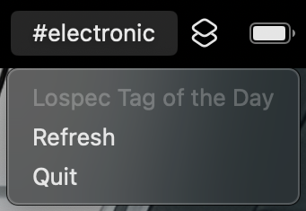

# LTOTD
### "Lospec Tag of the Day"

A **Mac OS** menu bar app that displays the "Tag of the Day" from [Lospec](https://lospec.com)

### Changes:
**v1.1.0** - Adds the option to enable or disable notifications

>[!NOTE]
>Due to limitations with the `rumps` framework, changing this preference doesn't update the notification permissions shown in MacOS System Settings

## Getting Started

Start the app and it will automatically fetch the [Tag of the Day](https://lospec.com/dailies/)

The app will refresh **every hour** while running, but you can also click on "Refresh" in the menu to refresh manually

You'll get a notification from the app when the `#tag` changes

## Installation
You can download the latest release [here](https://github.com/JRiggles/LTOTD/releases/download/v1.0.0/LTOTD.app.zip)

> [!IMPORTANT]
> If you get a warning message like this one when you try to open the app, just click "Cancel":
> 
>
> This is apparently caused by MacOS being overzealous about quarantining 3rd-party applications.
> To fix the issue, simply run the following command in your terminal:
> `xattr -d com.apple.quarantine /path/to/LTOTD.app`

*or you can...*

### Build it Yourself
If you're feeling motivated, you can also build the app yourself!

> [!NOTE]
> You'll need Python installed (this app was built using Python 3.14)

1. Clone this repo
2. Open a terminal and navigate to the root of the cloned directory, **LTOTD**
3. ***OPTIONAL*** - set up and activate a virtual environment using `venv` or something similar
3. Run the command `pip install -r requirements.txt` to install the necessary dependencies
4. Run the command `python setup.py py2app` to build the app

If everything worked, you'll find the app here:

`{wherever you cloned the repo}/LTOTD/dist/LTOTD.app`

## Dependencies
  - [httpx](https://github.com/encode/httpx)
  - [py2app](https://py2app.readthedocs.io/en/latest/index.html)
  - [rumps](https://github.com/jaredks/rumps?tab=readme-ov-file)

## TODO
  - Windows support (coming soon!)

## Acknowledgements
Lospec was created and is maintained by Sam Keddy, a.k.a [Skeddles](https://github.com/Skeddles)

- [Lospec on Patreon](https://www.patreon.com/lospec)
- [Lospec on GitHub](https://github.com/lospec)

*All copyrights are property of their respective owners*
